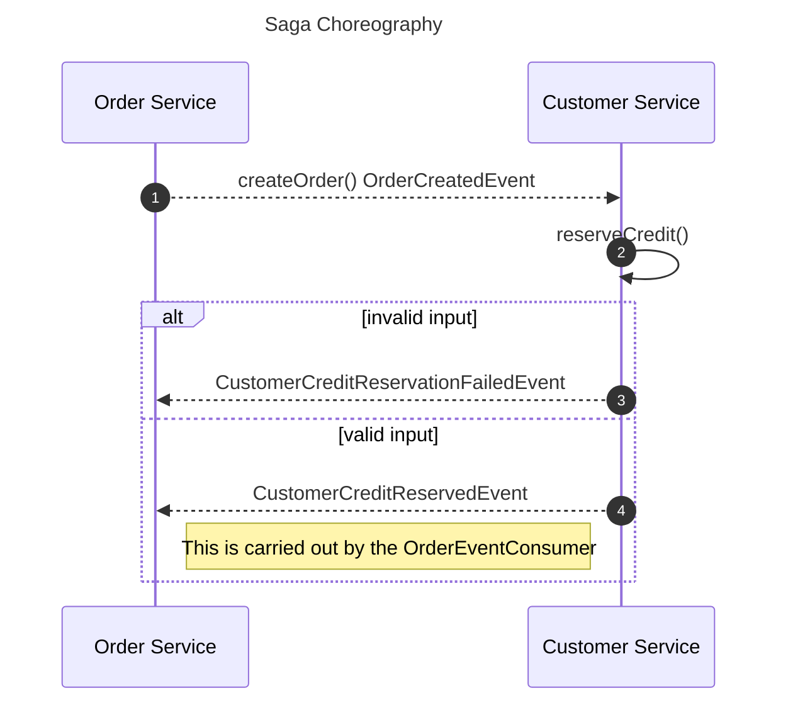

### Lab Implementing choreography based sagas

```mermaid
---
title: Saga Choreography
---

sequenceDiagram
    autonumber
    participant Order Service
    participant Customer Service
    
    Order Service-->>Customer Service: createOrder() OrderCreatedEvent
    Customer Service->>Customer Service: reserveCredit()
    
    alt invalid input
        Customer Service-->>Order Service: CustomerCreditReservationFailedEvent
    else valid input
        Customer Service-->>Order Service: CustomerCreditReservedEvent
        Note left of Customer Service: This is carried out by the OrderEventConsumer
    end
```